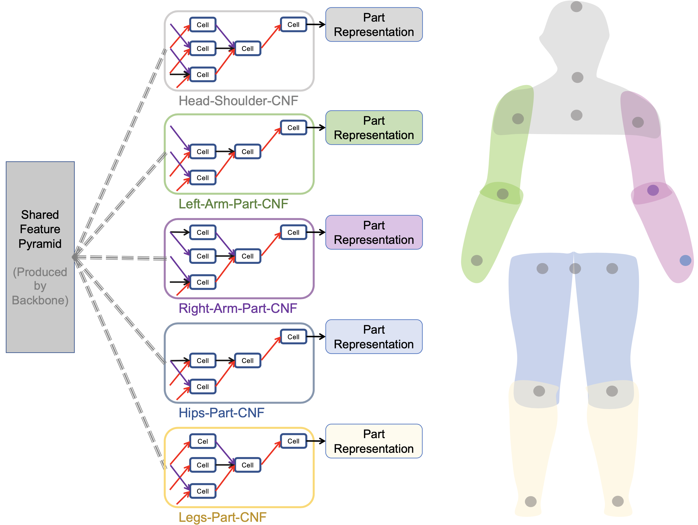

## Introduction

This repository is our PyTorch implementation of the paper [Pose Neural Fabrics Search (PNFS)](https://arxiv.org/pdf/1909.07068.pdf) ([arXiv 1909.07068](https://arxiv.org/abs/1909.07068)).  

Neural architecture search space at macro and micro level:


Search part-specific Cell-based Neural Fabrics (CNFs) with the guide of the prior knowledge of human body structure. 


## Usage

### Dependencies

Install `PyTorch` (>=1.0.0) and the packages mentioned in [`requirements.txt`](requirements.txt) by `pip install -r requirements.txt`.

### Data Preparation

We follow the steps of [this repository](https://github.com/microsoft/human-pose-estimation.pytorch) for preparing `MPII` and `COCO` dataset, please see the [https://github.com/microsoft/human-pose-estimation.pytorch#data-preparation](https://github.com/microsoft/human-pose-estimation.pytorch#data-preparation).

### Download ImageNet Pretrained Models

- Resnet-50 (23.5M): [Download](https://download.pytorch.org/models/resnet50-19c8e357.pth), 
- MobileNet-V2 (1.3M): [Google Drive](https://drive.google.com/open?id=1jlto6HRVD3ipNkAl1lNhDbkBp7HylaqR) from [this repo](https://github.com/tonylins/pytorch-mobilenet-v2).
- HRNet-W32-stem~stage3 (8.1M): [Google Drive](https://drive.google.com/drive/folders/1hOTihvbyIxsm5ygDpbUuJ7O_tzv4oXjC?usp=sharing) from [this repo](https://github.com/leoxiaobin/deep-high-resolution-net.pytorch). 
- More ...

### Create the `o` directory to preserve each experiment's output 

```
mkdir o  
```

### Train the model

```
python train.py \
--cfg configs/example.yaml \
--exp_name o/default_exp/ \
--gpu 0,1 
```
other optional commands for training

```
--batchsize 32  
--param_flop   // report parameters and FLOPs
--search search_method_name   // options: ['None','random','sync','first_order_gradient','second_order_gradient']
--debug   // visualize the input data
--visualize // visualize the predicted heatmaps for an image (per 5 epcohes in training)
--show_arch_value   // print the parameters of architecture in the training process
```

#### Distributed multi-gpu training in a single machine (node)

```
sh distributed.sh
```
`nproc_per_node` means how many gpus are used.

### Test the model

```
python test.py \
--cfg configs/mobilenet_v2_CNFx3_coco_384x288.yaml \
--exp_name o/mobile_cnf3_coco/ \
--gpu 0,1 \
--test_model /path_to/mobilenet-v2_nfx3_384x288_coco_ckpt.tar \
--flip_test 
```

other optional commands for testing
```
--visualize   // visualize the predicted heatmaps
--param_flop
---margin 1.25  // [1.0,1.5] margin between bbox border and input size when testing 
--flip_test   // horizontal flip test
--use_dt   // use the detection results of COCO val set or test-dev set
```

## Update

- [2020.5.20] Add the [**Prune**](src/architecture/model_prune.py) function 
```python
Arch=Prune(Arch, prune_cells=True, prune_operations=True)
```
to prune the useless cells and operations according to the architecture parameters. A new search result as below is obtained with *72.3 AP* performance with *15.9M* for *COCO test-dev2017*.




## Detailed Settings

All of the detailed settings of the model are recorded in the [`configs/*.yaml`](configs/).

#### Configuration for Fabric-Subnetwork

A snippet example of the `*.yaml` for the hyperparameters of subnetworks :

```yaml
subnetwork_config:

  dataset_name: 'coco'
  parts_num : 3
  cell_config:
      vector_in_pixel : True
      vector_dim: 8
      convolution_mode: '2D'
      
      search_alpha: true
      search_beta: true
      operators: ["skip_connect", "Sep_Conv_3x3","Atr_Conv_3x3","max_pool_3x3"] # 
      depth: 7
      cut_layers_num: 4  # first several layers
      size_types: [4,8,16,32] # scales is [1/4, 1/8, 1/16, 1/32]
      hidden_states_num: 1
      factor: 16
      input_nodes_num: 1 # default
```

#### Model
|BackBone + Head|Params/FLOPs|Result|Download|
|--|--|--|--|
|MobileNet-V2 + CNFx3|6.1M/4.0G|67.4-COCO Test-dev|[Google Drive](https://drive.google.com/drive/folders/1-GWqHDAwfVoPVaQPx30yPAdigC72FU4X)|
|HRNet-W32-stem~stage3 + CNFx5|16.4M/9.4G|90.1-MPII Val-set|[Google Drive](https://drive.google.com/drive/folders/1-GWqHDAwfVoPVaQPx30yPAdigC72FU4X)|
|HRNet-W32-stem~stage3 + CNFx5|15.9M/14.8G|72.3-COCO Test-dev|[Google Drive](https://drive.google.com/drive/folders/1-GWqHDAwfVoPVaQPx30yPAdigC72FU4X)|

See the paper ([newly](https://senyang-ml.github.io/2019/08/26/Pose-Neural-Fabrics-Search/2019-pose_neural_fabrics_search.pdf)) or configs for more details.

#### Body Parts Mode
The body keypoints assignment for different parts is defined in [`src/network_factory/body_parts.py`](src/network_factory/body_parts.py)

#### Vector Representation

We provide two types of convolutional mode `Conv2d` and `Conv3d` to show how to construct the vector representation (`5D-Tensor`) of keypoint in [`src/network_factory/subnetwork.py`](src/network_factory/subnetwork.py). We use the `Conv2d` mode (reshape `5D-Tensor` to `4D-Tensor`) by default.
#### Exploration

More potential cutomized computing units can be defined as candidate operations in [`src/architecture/operators.py`](src/architecture/operators.py).

## Citation

If it helps your research, please consider citing:

```
@article{yang2019pose,
  title={Pose Neural Fabrics Search},
  author={Yang, Sen and Yang, Wankou and Cui, Zhen},
  journal={arXiv preprint arXiv:1909.07068},
  year={2019}
}
```

